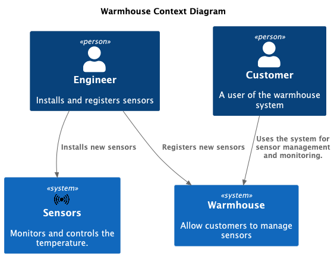
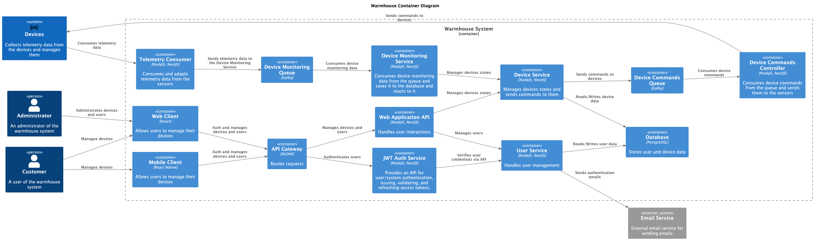
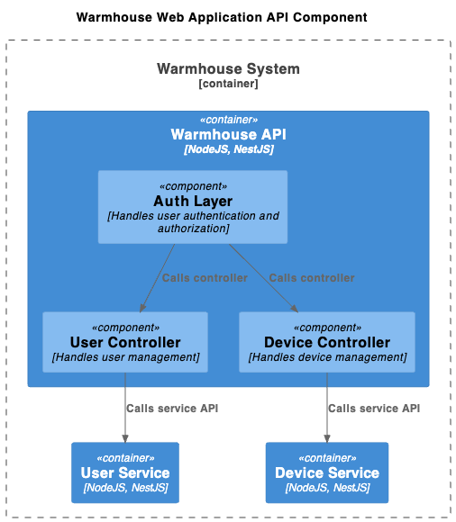
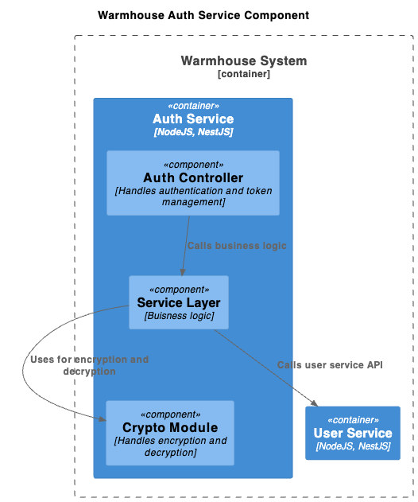
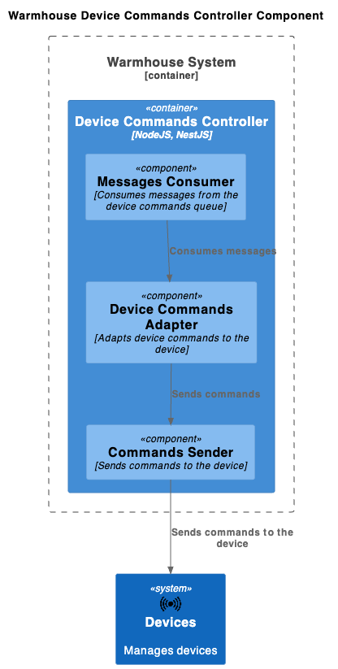
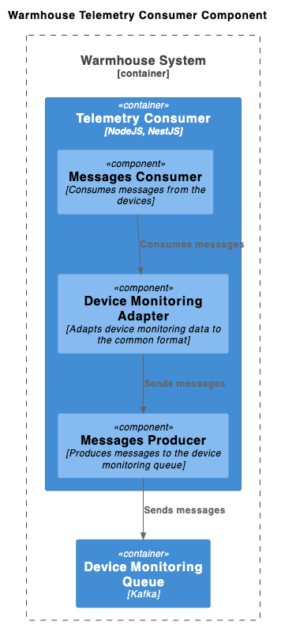
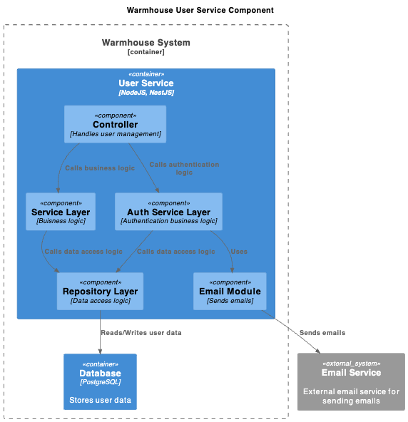
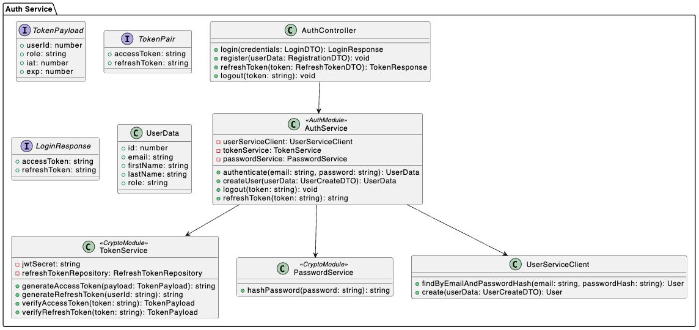
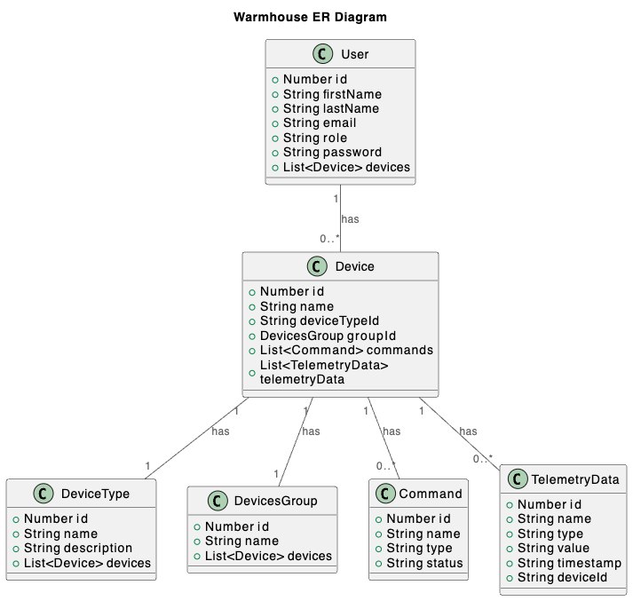

# Задание 1. Анализ и планирование

### 1. Описание функциональности монолитного приложения

**Управление отоплением:**

- Пользователи могут самостоятельно управлять отоплением в доме
- Система поддерживает
  - Подключение новых устройств
  - Удаленное управление

**Мониторинг температуры:**

- Пользователи могут удаленно мониторить температуру
- Система поддерживает
  - Подключение новых устройств
  - Удаленный мониторинг

### 2. Анализ архитектуры монолитного приложения

Перечислите здесь основные особенности текущего приложения: какой язык программирования используется, какая база данных, как организовано взаимодействие между компонентами и так далее.

- Язык программирования: GO
- База данных: PostgreSQL
- Архитекутара: Монолит
- Контейнеризация
  - Поддержака Docker и Docker Compose
  - Контейнеризация БД
- Интерфейс: RESTful API
- Halthcheck: роут /health

### 3. Определение доменов и границы контекстов

Опишите здесь домены, которые вы выделили.

**Домены:**

- Регистрация датчиков
- Управление датчиками
- Мониторинг датчиков

### **4. Проблемы монолитного решения**

Для текущих требований и масштабов монолитное решение вполне подходит.
Но по мере роста и развития проекта есть риски встретить следующие проблемы.

- **Масштабирование:** невозможно масштабировать отдельные части приложения
- **Развертывание:** изменение отдельных частей приложения требует перезапуска всего приложения
- **Локальная разработка** для тестирования и разработки отдельных частей системы необходимо запускать весь проект и держать его в актуальном состоянии. Замедляет разработку
- **Низкая отказоустойчивость:** Сбой в одной части приведет к отказу всего приложения
- **Распределение отвественности:** трудно выделить команды и распределить ответсвенность на отдельные части приложения из-за большой связности кода.
- **Тестирование:** изменение любой части системы требует тестирование всего приложения

### 5. Визуализация контекста системы — диаграмма С4



# Задание 2. Проектирование микросервисной архитектуры

В этом задании вам нужно предоставить только диаграммы в модели C4. Мы не просим вас отдельно описывать получившиеся микросервисы и то, как вы определили взаимодействия между компонентами To-Be системы. Если вы правильно подготовите диаграммы C4, они и так это покажут.

**Диаграмма контейнеров (Containers)**



**Диаграмма компонентов (Components) API**



**Диаграмма компонентов (Components) AuthService**



**Диаграмма компонентов (Components) DevcieCommandsController**



**Диаграмма компонентов (Components) TelemetryConsumer**



**Диаграмма компонентов (Components) UserService**



**Диаграмма кода (Code) AuthService**



# Задание 3. Разработка ER-диаграммы



# Задание 4. Создание и документирование API

### 1. Тип API

Испольуется два подхода 1. REST - для синхронного взаимодействия 2. Async (Kafka) - для асинхронного

Синхронное взаимодействие используется в местах, где нам необходим ответ от сервисов и отказоустойчивость не так критична.

Kafka же используется в местах, где нам необходима повышенная отказоустойчивость. Где реузльтат выполнения не ожидается мгновенно.

### 2. Документация API

Ссылки на директории с YML и со сгенерированной документацией.

[Директория с YML](./api/)

[Директория со сгенерированной документацией](./docs/)

Ниже представлены ссылки на каждую документацию на CF pages. Она генерируется автоматически при коммите и деплоется туда. Должны работать, если переходить по полному URL из README(а именно как указано в ссылках ниже).

[deviceCommandsController](https://architecture-warmhouse.pages.dev/async/deviceCommandsController/)

[deviceMonitoringService](https://architecture-warmhouse.pages.dev/async/deviceMonitoringService/)

[AuthService](https://architecture-warmhouse.pages.dev/openapi/authService/)

[Backend](https://architecture-warmhouse.pages.dev/openapi/backend/)

# Задание 5. Работа с docker и docker-compose

Перейдите в apps.

Там находится приложение-монолит для работы с датчиками температуры. В README.md описано как запустить решение.

Вам нужно:

1. сделать простое приложение temperature-api на любом удобном для вас языке программирования, которое при запросе /temperature?location= будет отдавать рандомное значение температуры.

Locations - название комнаты, sensorId - идентификатор названия комнаты

```
	// If no location is provided, use a default based on sensor ID
	if location == "" {
		switch sensorID {
		case "1":
			location = "Living Room"
		case "2":
			location = "Bedroom"
		case "3":
			location = "Kitchen"
		default:
			location = "Unknown"
		}
	}

	// If no sensor ID is provided, generate one based on location
	if sensorID == "" {
		switch location {
		case "Living Room":
			sensorID = "1"
		case "Bedroom":
			sensorID = "2"
		case "Kitchen":
			sensorID = "3"
		default:
			sensorID = "0"
		}
	}
```

2. Приложение следует упаковать в Docker и добавить в docker-compose. Порт по умолчанию должен быть 8081

3. Кроме того для smart_home приложения требуется база данных - добавьте в docker-compose файл настройки для запуска postgres с указанием скрипта инициализации ./smart_home/init.sql

Для проверки можно использовать Postman коллекцию smarthome-api.postman_collection.json и вызвать:

- Create Sensor
- Get All Sensors

Должно при каждом вызове отображаться разное значение температуры

Ревьюер будет проверять точно так же.
